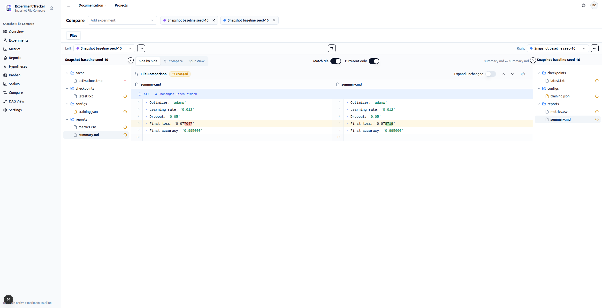
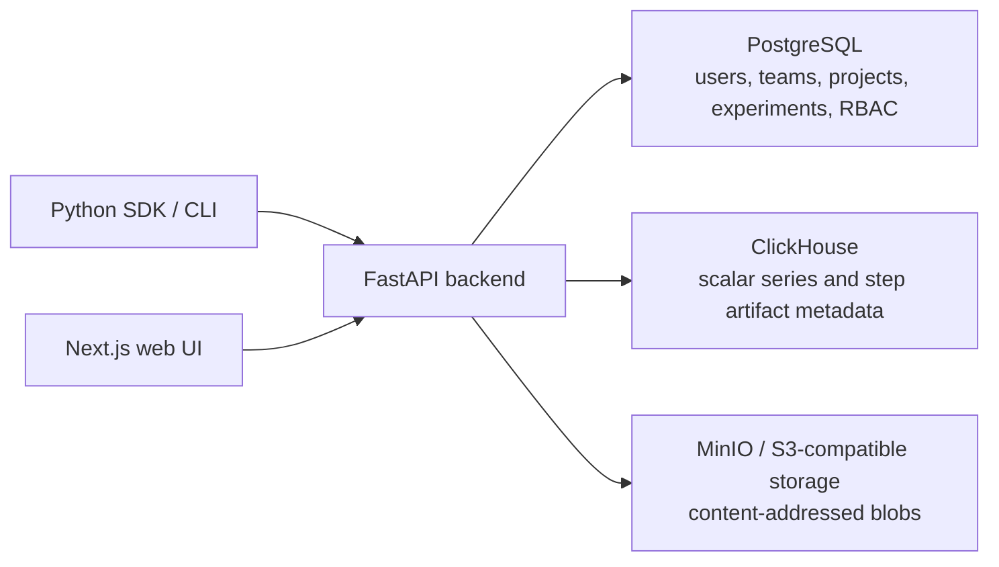

# Experiment Tracker: Self-Hosted ML Experiment Analysis Workspace

Docker installation and deployment: **[Docker Guide](DOCKER.md)**


Experiment Tracker is an open-source, self-hosted ML/DL experiment tracker for research-heavy workflows. It focuses on experiment understanding: compare final metrics, inspect scalar curves, review step-aware artifacts, and navigate experiment lineage in one workspace.

It is intentionally smaller than a full MLOps platform. The goal is not remote execution, infrastructure orchestration, production serving, or a universal training launcher. The goal is a clear research workspace for ML engineers and data scientists who run many experiments and need to understand what changed, which run improved, and why.

> A self-hosted experiment tracker for research-heavy ML workflows: metrics-first comparison, readable scalar curves, step-aware artifacts, and experiment lineage without turning your setup into a full MLOps platform.

## What It Is For

- **Metrics-first model selection:** compare final metrics and labeled metric snapshots across many runs before drilling into details.
- **Readable scalar analysis:** inspect training and validation curves across experiments with smoothing, compare hover, zooming, and backend downsampling.
- **Step-aware artifact review:** keep generated images, predictions, text outputs, checkpoints, configs, and project files attached to experiment context.
- **Experiment lineage:** track parent-child research branches, metric deltas, and how one run evolved from another.
- **Self-hosted research history:** own experiment metadata, scalar series, artifacts, notes, and reports in your own stack.

## What It Is Not

Experiment Tracker is not a training orchestrator, deployment platform, model registry, hyperparameter sweep engine, GPU queue, or agent execution system. If you need a broad AI platform with pipelines, autoscaling infrastructure, registry workflows, automations, and deployment layers, tools like W&B or ClearML cover a larger surface area.

Use Experiment Tracker when you want a focused, self-hosted research workspace for understanding experiments rather than managing infrastructure.

## Why Not Just TensorBoard?

TensorBoard is excellent for local visualization. Experiment Tracker keeps TensorBoard-like logging ergonomics but adds project-level research context around those logs:

- final metric comparison tables for choosing the best run;
- scalar curves designed for comparing many experiments;
- step-aware and named artifacts;
- notes, reports, hypotheses, teams, and project metadata;
- editable experiment lineage instead of only a flat list of runs.

## Machine Learning Experiment Comparison


### Features for researchers

- **Dense model-selection table:** compare final or labeled metric snapshots across experiments in a project-scoped grid.
- **Research workflow controls:** filter runs, sort and resize columns, hide rows or metrics, export tables, highlight min/max values, and inspect selected experiment metadata in the side panel.
- **Clear metric language:** use final metrics and metric snapshots for model selection; use scalar curves for training dynamics.

## Scalar Metrics and Logged Artifacts


### Features for researchers

- **Curves built for comparison:** visualize multi-run scalar curves with synchronized axes, smoothing, compare hover, nearest-point hover, resizable cards, saved views, and selective visibility for each metric stream.
- **Readable curves at scale:** scalar queries are backed by ClickHouse and sampled per metric and per experiment, so charts stay usable when training logs get large.
- **Artifacts in training context:** inspect images, predictions, generated samples, text outputs, and other logged objects beside scalar trends, grouped by type and name, with step-aware controls.

## Experiment Lineage and Research History


### Features for researchers

- **Research tree, not just run list:** track parent-child relationships between runs and understand how baselines became follow-up experiments.
- **Metric deltas along branches:** compare selected metrics against each run's parent directly in the lineage view.
- **Editable lineage:** search, highlight, persist layout, and update parent links while keeping cycle checks in place.


## Files comparison



### Features for researchers

- **Side by side diff:** compare two files side by side with diff highlighting.
- **Inline highlighting:** highlight changed lines in the file.
- **Experiment to experiment comparison:** compare two experiments side by side with diff highlighting.

## Architecture Designed Around Experiment Data

Experiment Tracker separates data by workload instead of forcing everything into one store:



- **PostgreSQL:** relational state such as users, teams, projects, experiments, permissions, notes, and reports.
- **ClickHouse:** high-volume scalar time series and step-aware artifact metadata.
- **S3-compatible object storage:** heavy blobs and content-addressed project artifacts.
- **FastAPI backend:** orchestration layer between the UI, SDK, relational state, scalar storage, and object storage.

This makes the product lightweight from a workflow perspective while still matching the actual shape of ML experiment data.

## Core Capabilities

| Area | What it helps researchers do |
|------|-------------------------------|
| Experiment tracking | Record runs, status, tags, metadata, notes, and project context. |
| Metrics comparison | Compare final scores and labeled metric snapshots across models in a dense table. |
| Scalar visualization | Explore loss, accuracy, learning rate, validation metrics, and custom scalar curves with comparison-focused chart tools. |
| Step-aware artifacts | Review images, predictions, generated samples, text outputs, and other objects at the training step where they were logged. |
| Named artifacts | Store checkpoints, configs, final exports, and other stable experiment files. |
| Project artifacts | Deduplicate shared project files by content hash for datasets, code snapshots, configs, and reusable assets. |
| Research lineage | Keep parent-child run relationships and metric deltas connected to experiment history. |
| Research organization | Keep hypotheses, reports, kanban items, notes, and SDK-driven training logs in one project workspace. |
| Self-hosted stack | Run the UI, API, scalars service, object storage, PostgreSQL, ClickHouse, and MinIO/S3-compatible storage with Docker or local development tools. |

## Positioning

Experiment Tracker is best described as a **self-hosted ML experiment analysis workspace** or a **research-first experiment tracker for ML/DL workflows**.

- Compared with **W&B**, it is intentionally narrower: focused on metrics, curves, artifacts, and lineage rather than a broad system of record with sweeps, reports, automations, registry, and platform workflows.
- Compared with **ClearML**, it does not try to be an end-to-end AI platform with infrastructure control, queues, pipelines, and deployment.
- Compared with **TensorBoard**, it keeps familiar logging ideas while adding project-level comparison, experiment metadata, artifacts, notes, and lineage.

The sharpest summary:

> Experiment Tracker helps ML engineers understand experiment evolution, not just log runs: metrics-first comparison, readable scalar curves, step-aware artifacts, and lineage-aware run history in a self-hosted stack.

## Quick Docker Install

Install Docker with the Compose plugin, then download the required deployment files:

```bash
mkdir -p experiment-tracker && cd experiment-tracker
curl -fsSLO https://raw.githubusercontent.com/MalchuL/experiment_tracker/main/docker-compose.yml
curl -fsSLO https://raw.githubusercontent.com/MalchuL/experiment_tracker/main/scripts/docker-up-public.sh
chmod +x docker-up-public.sh
```

Choose one way to start the stack:

```bash
docker compose up -d
./docker-up-public.sh http://127.0.0.1:3000
./docker-up-public.sh https://tracker.example.com https://api.example.com
sudo PUBLIC_URL=http://192.168.1.247 WEB_PORT=3000 ./docker-up-public.sh
sudo PUBLIC_URL=http://192.168.1.247 ./docker-up-public.sh

```

The first command uses the default localhost configuration. The second configures a browser-reachable local URL. The third configures separate public UI and API URLs.

**Now you can open the UI at http://127.0.0.1:3000 or https://tracker.example.com.**

Stop the stack without deleting stored data:

```bash
docker compose down
```

## Python SDK

### Install

```
pip install "experiment-tracker-sdk @ git+https://github.com/MalchuL/experiment_tracker.git@main#subdirectory=python/sdk"
```

Using uv:
```
uv pip install "git+https://github.com/MalchuL/experiment_tracker.git@main#subdirectory=python/sdk"
```

### Get API token

1. Register new user in the web UI at http://127.0.0.1:3000. You can use any email and password (they will not be used for anything and stored in the local database).
2. Click in top right corner and select "API Tokens"
3. Click on "Create Token" (Use all permissions for now)
4. Enter a name for the token
5. Click on "Create"
6. Copy the token (It will only be shown once). Or you can copy whole command to initialize the SDK.
7. (Optional) Run the command (but if you use uv use `uv run command`). `uv run experiment-tracker init --base-url "http://127.0.0.1:8000" --api-prefix "/api" --api-token "pat_nOMwtEGLRZVFI_8IzQi6jmx3YDUGPJL73TgQmxMRBjc"`


### Configure

The SDK installs three equivalent console entry points:

- `experiment-tracker` (full name)
- `exp-tracker`
- `exp-track`

They all invoke the same CLI; use whichever name you prefer. Examples below use
`experiment-tracker`, but `exp-tracker` and `exp-track` work the same way.

The CLI is implemented with [Click](https://click.palletsprojects.io/).

Optional environment defaults for interactive `experiment-tracker init` (when
you omit flags and press Enter at prompts) can be set with the `EXP_TRACKER_`
prefix, for example `EXP_TRACKER_DEFAULT_BASE_URL` and
`EXP_TRACKER_DEFAULT_API_PREFIX`. Values are read from the process environment
and an optional `.env` file in the current working directory (see
`experiment_tracker_sdk.settings`).

Save the backend base URL and API token:

**Use the backend URL here, not the UI URL. Example: http://127.0.0.1:8000**
```
uv run exp-tracker init --base-url http://127.0.0.1:8000 --api-token <TOKEN>
```

Check connectivity or token validity (first checks connectivity to the backend and then checks if the token is valid):

```
uv run experiment-tracker ping
uv run experiment-tracker whoami
```

### Run a training script
There is mock training script in `examples/training/train.py`. It is a simple script to show logging capabilities of the SDK.
```
cd examples/training
uv run python train.py --project-name "SDK Training" --team-name "My First Team" --experiment-name "Experiment 0"
```

For **large artifact upload/download with tqdm progress** (files >= 50 MiB), see `examples/verbose-artifact-transfer/`:
```
cd examples/verbose-artifact-transfer
uv sync
uv run python train.py --project-name "SDK Verbose Artifacts" --experiment-name "Large transfer demo"
```

If you want to run script and don't change anything in the script of script and have tensorboardX installed, you can use the following command:
```
cd examples/pytorch-mnist-tensorboardx
uv run experiment-tracker run --project mnist --experiment "Experiment 0" train.py -- --epochs 100 --max-train-batches 50 --max-val-batches 50
```
This script runs train.py script with args passed after `--` token.
It will create or fetch project "mnist" and experiment "Experiment 0" if they don't exist.
After that it captures tensorboardX events and logs them to the backend.


## Local Development

For manual local setup with Postgres, MinIO, ClickHouse, the Python services, and the Next.js frontend, see [LOCAL_RUN.md](LOCAL_RUN.md).
