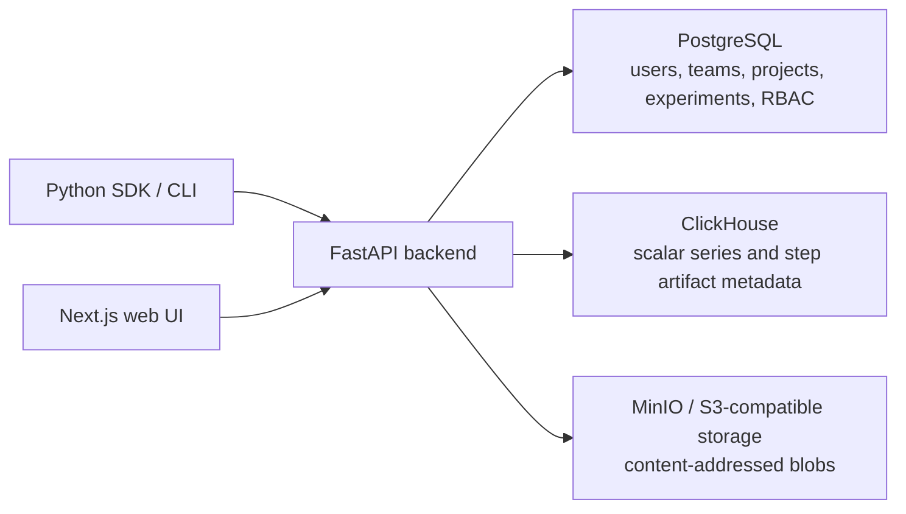

# Experiment Tracker: Self-Hosted ML Experiment Analysis Workspace


Experiment Tracker is an open-source, self-hosted ML/DL experiment tracker for research-heavy workflows. It focuses on experiment understanding: compare final metrics, inspect scalar curves, review step-aware artifacts, and navigate experiment lineage in one workspace.

It is intentionally smaller than a full MLOps platform. The goal is not remote execution, infrastructure orchestration, production serving, or a universal training launcher. The goal is a clear research workspace for ML engineers and data scientists who run many experiments and need to understand what changed, which run improved, and why.

> A self-hosted experiment tracker for research-heavy ML workflows: metrics-first comparison, readable scalar curves, step-aware artifacts, and experiment lineage without turning your setup into a full MLOps platform.

## What It Is For

- **Metrics-first model selection:** compare final metrics and labeled metric snapshots across many runs before drilling into details.
- **Readable scalar analysis:** inspect training and validation curves across experiments with smoothing, compare hover, zooming, and backend downsampling.
- **Step-aware artifact review:** keep generated images, predictions, text outputs, checkpoints, configs, and project files attached to experiment context.
- **Experiment lineage:** track parent-child research branches, metric deltas, and how one run evolved from another.
- **Self-hosted research history:** own experiment metadata, scalar series, artifacts, notes, and reports in your own stack.

## What It Is Not

Experiment Tracker is not a training orchestrator, deployment platform, model registry, hyperparameter sweep engine, GPU queue, or agent execution system. If you need a broad AI platform with pipelines, autoscaling infrastructure, registry workflows, automations, and deployment layers, tools like W&B or ClearML cover a larger surface area.

Use Experiment Tracker when you want a focused, self-hosted research workspace for understanding experiments rather than managing infrastructure.

## Why Not Just TensorBoard?

TensorBoard is excellent for local visualization. Experiment Tracker keeps TensorBoard-like logging ergonomics but adds project-level research context around those logs:

- final metric comparison tables for choosing the best run;
- scalar curves designed for comparing many experiments;
- step-aware and named artifacts;
- notes, reports, hypotheses, teams, and project metadata;
- editable experiment lineage instead of only a flat list of runs.

## Machine Learning Experiment Comparison


### Features for researchers

- **Dense model-selection table:** compare final or labeled metric snapshots across experiments in a project-scoped grid.
- **Research workflow controls:** filter runs, sort and resize columns, hide rows or metrics, export tables, highlight min/max values, and inspect selected experiment metadata in the side panel.
- **Clear metric language:** use final metrics and metric snapshots for model selection; use scalar curves for training dynamics.

## Scalar Metrics and Logged Artifacts


### Features for researchers

- **Curves built for comparison:** visualize multi-run scalar curves with synchronized axes, smoothing, compare hover, nearest-point hover, resizable cards, saved views, and selective visibility for each metric stream.
- **Readable curves at scale:** scalar queries are backed by ClickHouse and sampled per metric and per experiment, so charts stay usable when training logs get large.
- **Artifacts in training context:** inspect images, predictions, generated samples, text outputs, and other logged objects beside scalar trends, grouped by type and name, with step-aware controls.

## Experiment Lineage and Research History


### Features for researchers

- **Research tree, not just run list:** track parent-child relationships between runs and understand how baselines became follow-up experiments.
- **Metric deltas along branches:** compare selected metrics against each run's parent directly in the lineage view.
- **Editable lineage:** search, highlight, persist layout, and update parent links while keeping cycle checks in place.

## Architecture Designed Around Experiment Data

Experiment Tracker separates data by workload instead of forcing everything into one store:



- **PostgreSQL:** relational state such as users, teams, projects, experiments, permissions, notes, and reports.
- **ClickHouse:** high-volume scalar time series and step-aware artifact metadata.
- **S3-compatible object storage:** heavy blobs and content-addressed project artifacts.
- **FastAPI backend:** orchestration layer between the UI, SDK, relational state, scalar storage, and object storage.

This makes the product lightweight from a workflow perspective while still matching the actual shape of ML experiment data.

## Core Capabilities

| Area | What it helps researchers do |
|------|-------------------------------|
| Experiment tracking | Record runs, status, tags, metadata, notes, and project context. |
| Metrics comparison | Compare final scores and labeled metric snapshots across models in a dense table. |
| Scalar visualization | Explore loss, accuracy, learning rate, validation metrics, and custom scalar curves with comparison-focused chart tools. |
| Step-aware artifacts | Review images, predictions, generated samples, text outputs, and other objects at the training step where they were logged. |
| Named artifacts | Store checkpoints, configs, final exports, and other stable experiment files. |
| Project artifacts | Deduplicate shared project files by content hash for datasets, code snapshots, configs, and reusable assets. |
| Research lineage | Keep parent-child run relationships and metric deltas connected to experiment history. |
| Research organization | Keep hypotheses, reports, kanban items, notes, and SDK-driven training logs in one project workspace. |
| Self-hosted stack | Run the UI, API, scalars service, object storage, PostgreSQL, ClickHouse, and MinIO/S3-compatible storage with Docker or local development tools. |

## Positioning

Experiment Tracker is best described as a **self-hosted ML experiment analysis workspace** or a **research-first experiment tracker for ML/DL workflows**.

- Compared with **W&B**, it is intentionally narrower: focused on metrics, curves, artifacts, and lineage rather than a broad system of record with sweeps, reports, automations, registry, and platform workflows.
- Compared with **ClearML**, it does not try to be an end-to-end AI platform with infrastructure control, queues, pipelines, and deployment.
- Compared with **TensorBoard**, it keeps familiar logging ideas while adding project-level comparison, experiment metadata, artifacts, notes, and lineage.

The sharpest summary:

> Experiment Tracker helps ML engineers understand experiment evolution, not just log runs: metrics-first comparison, readable scalar curves, step-aware artifacts, and lineage-aware run history in a self-hosted stack.

## Python SDK

### Install

```
pip install "experiment-tracker-sdk @ git+https://github.com/MalchuL/experiment_tracker.git@main#subdirectory=python/sdk"
```

Using uv:
```
uv pip install "git+https://github.com/MalchuL/experiment_tracker.git@main#subdirectory=python/sdk"
```

### Get API token

1. Register new user in the web UI at http://127.0.0.1:3000. You can use any email and password (they will not be used for anything and stored in the local database).
2. Click in top right corner and select "API Tokens"
3. Click on "Create Token" (Use all permissions for now)
4. Enter a name for the token
5. Click on "Create"
6. Copy the token (It will only be shown once). Or you can copy whole command to initialize the SDK.
7. (Optional) Run the command (but if you use uv use `uv run command`). `uv run experiment-tracker init --base-url "http://127.0.0.1:8000" --api-prefix "/api" --api-token "pat_nOMwtEGLRZVFI_8IzQi6jmx3YDUGPJL73TgQmxMRBjc"`


### Configure

The SDK installs three equivalent console entry points:

- `experiment-tracker` (full name)
- `exp-tracker`
- `exp-track`

They all invoke the same CLI; use whichever name you prefer. Examples below use
`experiment-tracker`, but `exp-tracker` and `exp-track` work the same way.

The CLI is implemented with [Click](https://click.palletsprojects.io/).

Optional environment defaults for interactive `experiment-tracker init` (when
you omit flags and press Enter at prompts) can be set with the `EXP_TRACKER_`
prefix, for example `EXP_TRACKER_DEFAULT_BASE_URL` and
`EXP_TRACKER_DEFAULT_API_PREFIX`. Values are read from the process environment
and an optional `.env` file in the current working directory (see
`experiment_tracker_sdk.settings`).

Save the backend base URL and API token:

**Use the backend URL here, not the UI URL. Example: http://127.0.0.1:8000**
```
uv run exp-tracker init --base-url http://127.0.0.1:8000 --api-token <TOKEN>
```

Check connectivity or token validity (first checks connectivity to the backend and then checks if the token is valid):

```
uv run experiment-tracker ping
uv run experiment-tracker whoami
```

### Run a training script
There is mock training script in `examples/training/train.py`. It is a simple script to show logging capabilities of the SDK.
```
cd examples/training
uv run python train.py --project-name "SDK Training" --team-name "My First Team" --experiment-name "Experiment 0"
```

If you want to run script and don't change anything in the script of script and have tensorboardX installed, you can use the following command:
```
cd examples/pytorch-mnist-tensorboardx
uv run experiment-tracker run --project mnist --experiment "Experiment 0" train.py -- --epochs 100 --max-train-batches 50 --max-val-batches 50
```
This script runs train.py script with args passed after `--` token.
It will create or fetch project "mnist" and experiment "Experiment 0" if they don't exist.
After that it captures tensorboardX events and logs them to the backend.


## Docker (full stack)

Run **all** services from `docker-compose.yml` (Postgres ×2, Redis, ClickHouse, MinIO, object-storage, scalars, backend, web). Hybrid setups, dependency details, and aggressive cache busting are covered in the sections below.

## Full stack: step by step

1. **Work from the repository root** (the folder that contains `docker-compose.yml`).

2. **Optional environment file.** To override ports, `JWT_SECRET`, `NEXT_PUBLIC_BASE_URL`, CORS, and so on, copy `.env.example` to `.env` in that same folder. If you skip this, Compose uses the defaults in `docker-compose.yml`. For a **single public UI URL** without maintaining `.env`, use **`./scripts/docker-up-public.sh`** (see **Custom URL or domain** → *One command without a `.env` file*). For local `uv` / `pnpm` development (without Docker), see each package `python/backend/.env.example`, `python/scalars_service/.env.example`, `python/object_storage/.env.example`, and `apps/web/.env.example`.

3. **`storage/` on disk.** Data is persisted under **`./storage/`** (for example `storage/postgres-backend`, `storage/clickhouse`). **You do not need to create these directories yourself:** Docker creates missing host paths for bind mounts when the containers start.

4. **Build images and start the stack** (detached):

   ```bash
   docker compose up -d --build
   ```

   Use `docker compose -f docker-compose.yml …` if you need an explicit file path. The first run can take several minutes. Omit `--build` when you only changed runtime env and the images are already built.

5. **Wait for health checks.** `web` starts only after `backend` is healthy; `backend` waits on Postgres, scalars, and object-storage. Watch status and logs:

   ```bash
   docker compose ps
   docker compose logs -f backend
   ```

   Press Ctrl+C to stop tailing logs; containers keep running.

6. **Open the UI.** With default host ports, the Next.js app is:

   **http://localhost:3000** (equivalently **http://127.0.0.1:3000**)

   The main API is on **http://localhost:8000** (interactive docs are usually at **http://localhost:3000/docs** for the UI and **http://localhost:8000/docs** for the swagger UI). The web image is built with `NEXT_PUBLIC_BASE_URL` (compose default **http://127.0.0.1:8000**) so the **browser** loads the API from your machine; if you change host ports, use a **custom domain**, or publish the UI elsewhere, set the variables in **Custom URL or domain** below and **rebuild** `web` (see `.env.example`).

**That's it!** You can now start training your models and track your experiments.
---

## Custom URL or domain (not `localhost` / `127.0.0.1`)

Use this when the UI or API is reached under a **real hostname**, **HTTPS**, or a **non-default port** on another machine (for example `https://tracker.example.com` for the app and `https://api.example.com` for the API).


### One command without a `.env` file (`PUBLIC_URL`)

From the repository root you can export everything from a **single UI origin** and start the stack (no root `.env` required). Simplest forms:

```bash
PUBLIC_URL=http://192.168.1.242 ./scripts/docker-up-public.sh
```

If the UI is on a **non-default** published port, set **`WEB_PORT`** (defaults to **3000**). For `http://…` URLs **without** an explicit port, the script adds **`http://<host>:<WEB_PORT>`** to **`ALLOWED_ORIGINS`** as well as the bare URL, so the browser `Origin` from `http://192.168.1.247:3000` matches after `PUBLIC_URL=http://192.168.1.247`. You can still set **`PUBLIC_URL=http://192.168.1.247:3000`** explicitly if you prefer a single origin string.

```bash
./scripts/docker-up-public.sh https://dashboard.example.com
```

The script sets **`ALLOWED_ORIGINS`** and **`OBJECT_STORAGE_ALLOWED_ORIGINS`** (see above for the `http` + no-port case), sets **`NEXT_PUBLIC_BASE_URL`** to the same host with port **8000** unless you pass a second URL (so `http://192.168.1.242` implies `http://192.168.1.242:8000` for the API), keeps **`SERVER_API_BASE_URL=http://backend:8000`**, then runs **`docker compose up -d --build`**.

- **Different API host:** pass a second URL:  
  `./scripts/docker-up-public.sh https://dashboard.example.com https://api.example.com`
- **Same as env var:**  
  `PUBLIC_URL=https://dashboard.example.com ./scripts/docker-up-public.sh`
- **Only `PUBLIC_URL`:** the script is the supported “single variable” entrypoint; it fills in the other exports for Compose.
- **Different compose invocation:** append `--` and arguments, e.g.  
  `./scripts/docker-up-public.sh http://myhost:3000 -- up -d`

Override the in-container BFF target only if needed:  
`SERVER_API_BASE_URL=http://other:8000 PUBLIC_URL=... ./scripts/docker-up-public.sh`

### If docker compose only works with sudo

- **`docker compose …`** and **`./scripts/docker-up-public.sh`** (it ends with `docker compose …`): normally **no `sudo`** if your user can talk to the Docker daemon (Linux: user is in the **`docker`** group, or Docker Desktop on Mac/Windows). If you see *permission denied* on the Docker socket, you can run Compose **with** `sudo` until permissions are fixed (not ideal long-term).
- **`sudo` and `PUBLIC_URL` for `docker-up-public.sh`:** assignments **between** `sudo` and the program are passed into **that** command’s environment (not the same as `PUBLIC_URL=…` *before* `sudo`, which applies only to your shell, not to root’s process). Typical pattern:

  ```bash
  sudo PUBLIC_URL=http://192.168.1.247 ./scripts/docker-up-public.sh
  sudo PUBLIC_URL=http://192.168.1.247 WEB_PORT=3000 ./scripts/docker-up-public.sh
  ```

  **Alternative:** pass URLs as arguments so nothing depends on env (works even when assignment-style `sudo` is restricted by `sudoers`):

  ```bash
  sudo ./scripts/docker-up-public.sh http://192.168.1.247
  sudo ./scripts/docker-up-public.sh http://192.168.1.247 http://192.168.1.247:8000
  ```

  If you already **exported** `PUBLIC_URL` / `WEB_PORT` in your shell and need root to see them, use **`sudo -E`** (preserve environment) or inline vars: **`sudo -E env PUBLIC_URL=… WEB_PORT=… ./scripts/docker-up-public.sh`**. **`-E` is a `sudo` flag**, not a `bash` flag. If the script is not executable, use `sudo PUBLIC_URL=… bash ./scripts/docker-up-public.sh`.

  Running the script as root can create **root-owned files** under `./storage/`; prefer adding your user to the **`docker`** group and running **without** `sudo`.

- **`rm -rf storage/`**: usually **no `sudo`** if files are owned by your user. If containers ran as root and created root-owned files under `./storage`, removal may fail until you run **`sudo rm -rf storage/`** once (then prefer running Docker with a user mapping or fix ownership with `sudo chown -R "$USER:$USER" storage/` if you want to avoid root-owned bind mounts).
- **Installing Docker or changing groups** is a one-time admin task and may require `sudo` or an administrator account on your OS.

### If you want to run docker compose with custom URL

**Root `.env`** (repository root, next to `docker-compose.yml`). Set at least:

   | Variable | Who consumes it | What to set |
   |----------|-----------------|-------------|
   | `NEXT_PUBLIC_BASE_URL` | **Web image build** (`web` Dockerfile build-arg) | Full base URL of the **main API as the user’s browser calls it** (scheme + host + port if not 443/80). Example: `https://api.example.com`. No trailing slash. This value is baked into the Next.js client bundle. |
   | `ALLOWED_ORIGINS` | **Backend** container | Comma-separated **origins of the UI** exactly as the browser sends them in `Origin` (scheme + host + port). Example: `https://tracker.example.com`. Add `http://localhost:3000` too if you still use local dev against the same backend. |
   | `OBJECT_STORAGE_ALLOWED_ORIGINS` | **object-storage** container | Same idea as `ALLOWED_ORIGINS` (browser talks to object-storage for some flows). Usually match `ALLOWED_ORIGINS`. |
   | `SERVER_API_BASE_URL` | **Web** container at **runtime** | Leave the default **`http://backend:8000`** when `web` and `backend` are both services in this Compose file. Only override if your Next server reaches the API by a different internal URL. |

2. **Rebuild the `web` image** after changing `NEXT_PUBLIC_BASE_URL` (it is read at `next build`, not at container start):

   ```bash
   docker compose build web --no-cache
   docker compose up -d web
   ```

3. **Restart backend and object-storage** after changing CORS variables (no rebuild required unless you changed code):

   ```bash
   docker compose up -d --force-recreate backend object-storage
   ```

4. **Reverse proxy / TLS** in front of Compose: the browser must still be able to resolve `NEXT_PUBLIC_BASE_URL` to your API and the UI origin must appear in `ALLOWED_ORIGINS`. Service-to-service URLs inside Compose (`http://backend:8000`, `http://scalars:8001/api`, etc.) stay on the Docker network and do not need to use your public domain.

Docker guide is available in [DOCKER.md](DOCKER.md).

## Local Development

For manual local setup with Postgres, MinIO, ClickHouse, the Python services, and the Next.js frontend, see [LOCAL_RUN.md](LOCAL_RUN.md).
