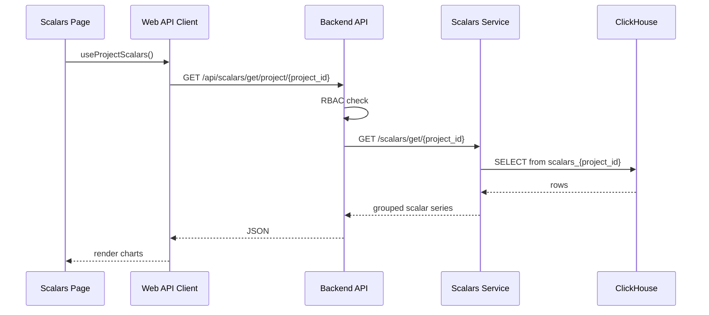
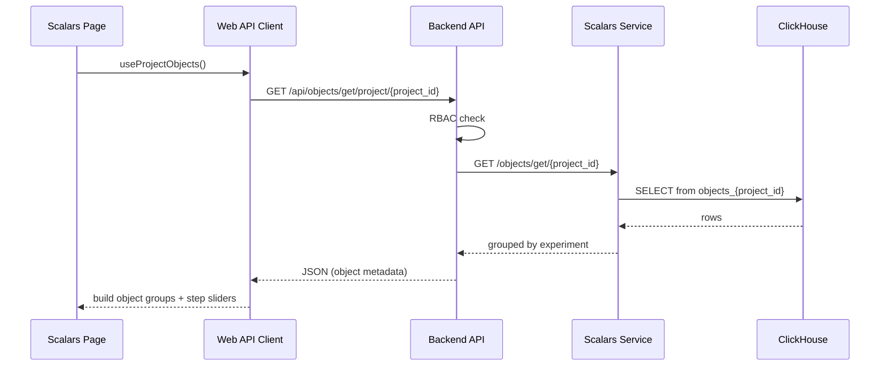
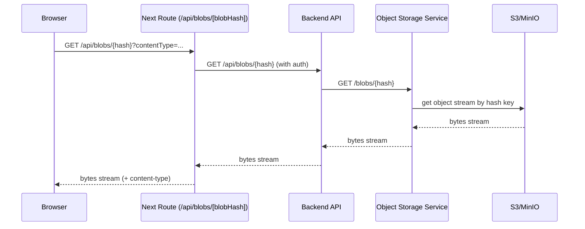

# Fetching Flow: Scalars and Images

This document describes how scalar and image data is fetched for UI rendering:
- method call chain
- HTTP request flow
- where data is transformed

## 1) Scalars Fetching Flow

### High-level method flow (frontend)

1. Scalars page calls `useProjectScalars(...)`.
2. Hook calls `scalarsService.getByProject(projectId, params)`.
3. Frontend API client requests:
   - `GET /api/scalars/get/project/{project_id}`
4. Backend (`domain/scalars`) checks permissions and forwards to scalars service:
   - `GET {SCALARS_SERVICE_URL}/scalars/get/{project_id}`
5. Scalars service queries ClickHouse table:
   - `scalars_{project_id}`
6. Result is grouped by experiment + scalar series and returned to UI.

### HTTP sequence

## 2) Images (Logged Objects) Fetching Flow

There are two independent fetch paths:

1. **Metadata fetch** (which object to display)
2. **Blob fetch** (binary image/video/audio payload)

## 2.1 Metadata fetch

### High-level method flow (frontend)

1. Scalars page calls `useProjectObjects(...)`.
2. Hook calls `loggedObjectsService.getByProject(...)`.
3. Frontend requests:
   - `GET /api/objects/get/project/{project_id}`
4. Backend (`domain/objects`) checks permissions and forwards to scalars service:
   - `GET {SCALARS_SERVICE_URL}/objects/get/{project_id}`
5. Scalars service queries ClickHouse table:
   - `objects_{project_id}`
6. UI groups by `object_type -> name`, then picks closest step per experiment.

### HTTP sequence

## 2.2 Blob fetch

### High-level method flow (frontend)

1. UI renders blob URL:
   - `/api/blobs/{blob_hash}?contentType=image/png` (optional MIME hint)
2. Next.js route handler proxies request to backend:
   - `GET {BASE_URL}/api/blobs/{blob_hash}`
3. Backend proxies to object storage service:
   - `GET {OBJECT_STORAGE_URL}/blobs/{blob_hash}`
4. Object storage service streams blob bytes from S3/MinIO.
5. Response stream is returned to browser.

### HTTP sequence

## Notes

- UI step selection is debounced (1.5s) before switching object source URLs to avoid refetching on each slider tick.
- Per-experiment step override can select a different nearest step than global slider.
- Metadata and blob content are fetched separately by design:
  - metadata from ClickHouse (`scalars_service`)
  - bytes from object storage (S3/MinIO).
