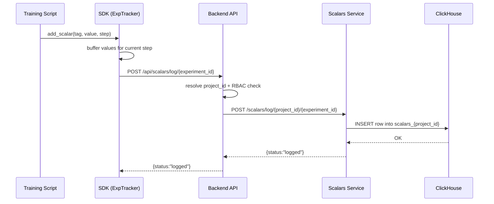
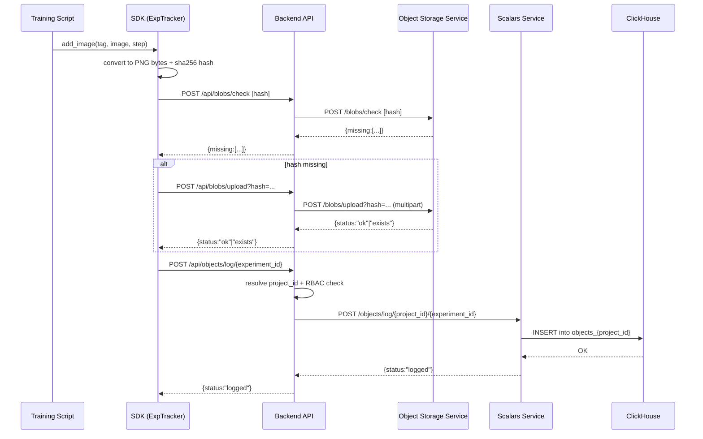

# Logging Flow: Scalars and Images

This document describes how scalar and image data is logged end-to-end:
- SDK method calls
- backend/scalars_service/object_storage interactions
- HTTP request sequence

## 1) Scalars Logging Flow

### High-level method flow

1. Training code calls:
   - `ExpTracker.add_scalar(...)`
   - or multiple calls for the same step.
2. SDK batches values per step in memory:
   - `ExpTracker._current_values`
3. On step change (or `flush()/close()`), SDK enqueues:
   - `API.scalars.log_scalar(...)`
4. `ExperimentTrackerClient` sends request to backend:
   - `POST /api/scalars/log/{experiment_id}`
5. Backend (`domain/scalars`) resolves `project_id`, checks permissions, and forwards to scalars service:
   - `POST {SCALARS_SERVICE_URL}/scalars/log/{project_id}/{experiment_id}`
6. Scalars service writes into per-project ClickHouse table:
   - `scalars_{project_id}`

### HTTP sequence

## 2) Images Logging Flow

### High-level method flow

1. Training code calls:
   - `ExpTracker.add_image(tag, img, step)`
2. SDK converts image to PNG bytes:
   - accepts `PIL.Image` or `numpy.ndarray`
   - normalizes/casts to uint8
   - converts layout to RGB/RGBA
3. SDK computes content hash:
   - `sha256(content_bytes)` => `blob_hash`
4. SDK checks if blob already exists:
   - `POST /api/blobs/check`
5. If missing, SDK uploads blob:
   - `POST /api/blobs/upload?hash={blob_hash}` (multipart)
6. SDK logs image metadata as object row:
   - `POST /api/objects/log/{experiment_id}`
7. Backend (`domain/objects`) resolves `project_id`, checks permissions, and forwards to scalars service:
   - `POST {SCALARS_SERVICE_URL}/objects/log/{project_id}/{experiment_id}`
8. Scalars service writes metadata row into:
   - `objects_{project_id}` (ClickHouse)

### HTTP sequence

## Notes

- Blob content is stored in object storage (S3/MinIO).
- Only lightweight metadata is stored in ClickHouse (`objects_{project_id}`), which keeps UI queries fast.
- For images, `path` currently stores the blob hash reference.
