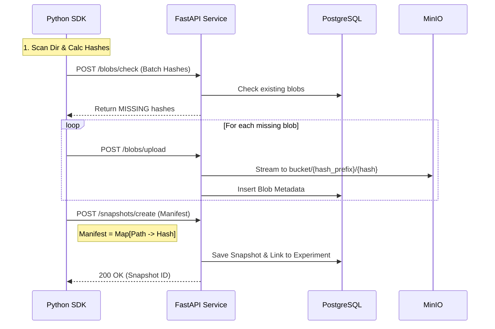

Here is the comprehensive technical task (Tech Task) for the **ML Experiment Storage Service**. You can use this document for planning, tracking, or assigning tasks to developers.

***

# Technical Task: ML Experiment Storage Service (CAS-based)

## 1. Overview
**Objective:** Develop a high-performance, deduplicated storage microservice for Machine Learning experiments.
**Problem:** Storing ML experiment artifacts (models, datasets, logs) via Git is inefficient. Standard storage solutions lack deduplication, leading to massive storage overhead when experiments share 90% of files (e.g., unchanged datasets or code).
**Solution:** A **Content-Addressable Storage (CAS)** system. Files are addressed by their content hash (SHA-256). Identical files are stored only once, regardless of how many experiments use them.

## 2. Architecture High-Level
*   **Backend:** Python (FastAPI) + PostgreSQL (Metadata) + MinIO (Blob Storage).
*   **Client:** Python SDK (integrated into ML pipelines).
*   **Protocol:** HTTP/REST.



***

## 3. Backend Specifications (FastAPI)

### 3.1. Infrastructure Requirements
*   **Containerization:** Docker & Docker Compose.
*   **Storage:** MinIO (S3 compatible). Bucket name: `ml-blobs`.
*   **Database:** PostgreSQL 15+.

### 3.2. Data Model (PostgreSQL)
*   **`experiments`**: `id` (UUID), `name` (unique), `created_at`.
*   **`snapshots`**: `id` (UUID), `experiment_id` (FK), `created_at`, `manifest` (JSONB).
    *   *Note: `manifest` structure: `[{"path": "model.pt", "hash": "sha256...", "size": 1024}]`*.
*   **`blobs`**: `hash` (PK, CHAR(64)), `size` (BigInt), `ref_count` (Int), `created_at`.

### 3.3. API Endpoints

#### `POST /blobs/check`
*   **Input:** List of SHA-256 hashes `["abc...", "def..."]`.
*   **Logic:** Query DB/MinIO to check existence.
*   **Output:** List of **missing** hashes that need upload.

#### `POST /blobs/upload`
*   **Input:** Multipart/form-data (`file`), Query param (`hash`).
*   **Logic:**
    1.  Validate file integrity (optional: stream & calc hash on fly).
    2.  Check if blob exists (idempotency).
    3.  Stream upload to MinIO path: `blobs/{hash[:2]}/{hash[2:]}`.
    4.  Register in `blobs` table.
*   **Output:** `200 OK`.

#### `POST /snapshots`
*   **Input:** JSON payload:
    ```json
    {
      "experiment_name": "resnet-training-v1",
      "files": [
        {"path": "config.yaml", "hash": "...", "size": 123},
        {"path": "weights.pt", "hash": "...", "size": 99999}
      ]
    }
    ```
*   **Logic:**
    1.  Verify all hashes in `files` exist in `blobs` table.
    2.  Create `experiment` if not exists.
    3.  Save record to `snapshots`.
*   **Output:** `{"snapshot_id": "uuid"}`.

#### `GET /snapshots/{id}/download` (Optional Phase 2)
*   **Logic:** Accept Snapshot ID, stream a generated ZIP file containing all files mapped to their original paths.

***

## 4. Client SDK Specifications (Python)

### 4.1. Core Logic
The client must handle heavy lifting to offload the server.

1.  **File Scanning:**
    *   Recursively scan target directory.
    *   **Filtering:** Implement `.gitignore`-style parsing (ignore `.git`, `__pycache__`, local venv).

2.  **Hashing Strategy:**
    *   Algorithm: **SHA-256**.
    *   **Optimization:** Use `ThreadPoolExecutor` to hash files in parallel.
    *   **Caching:** Maintain a local SQLite/Pickle cache `(path, mtime, size) -> hash` to skip re-hashing unchanged large files (e.g., 5GB datasets).

3.  **Upload Orchestration:**
    *   Step 1: Get file list -> Calculate Hashes.
    *   Step 2: Call `/blobs/check`.
    *   Step 3: Upload **only** missing files (Parallel uploads using `requests.Session`).
    *   Step 4: Commit Snapshot.

### 4.2. Interface Example
```python
from ml_storage import ExperimentTracker

tracker = ExperimentTracker(api_url="http://localhost:8000")

tracker.snapshot(
    experiment="my-model-v1",
    path="./project_folder",
    ignore_patterns=["*.tmp", "data/raw/*"]
)
```

***

## 5. Non-Functional Requirements
1.  **Scalability:** The system must handle files up to **5GB**.
    *   *Implementation Detail:* Use `spooled` temporary files in FastAPI or direct stream to MinIO to avoid RAM OOM.
2.  **Performance:**
    *   Deduplication check must be < 200ms for 1000 files.
    *   Hashing on client must saturate disk I/O.
3.  **Security:** (Basic for MVP)
    *   API Key authentication via Header.

## 6. Definition of Done (DoD)
1.  Server running via `docker-compose up`.
2.  Client SDK can upload a folder with a 1GB file.
3.  Running the upload twice results in **0 bytes uploaded** on the second run (Deduplication verified).
4.  Snapshot record appears in PostgreSQL with correct JSON structure.
5.  Files are physically present in MinIO bucket.