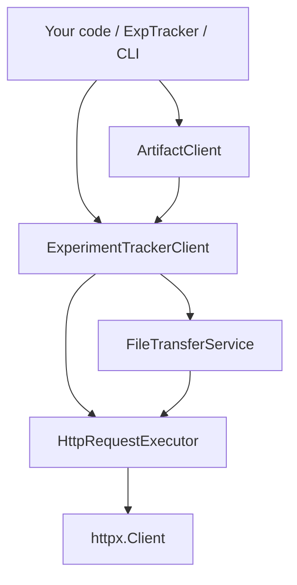
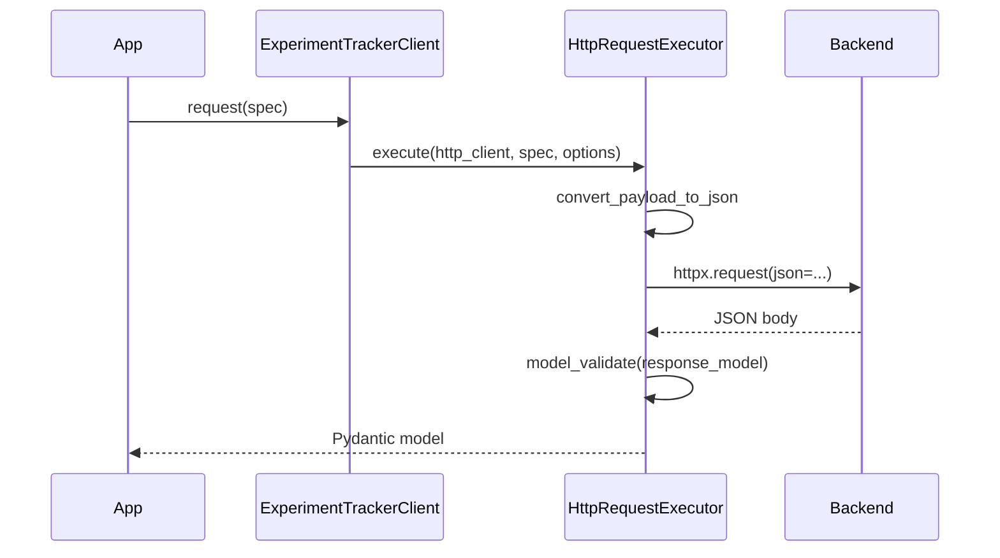
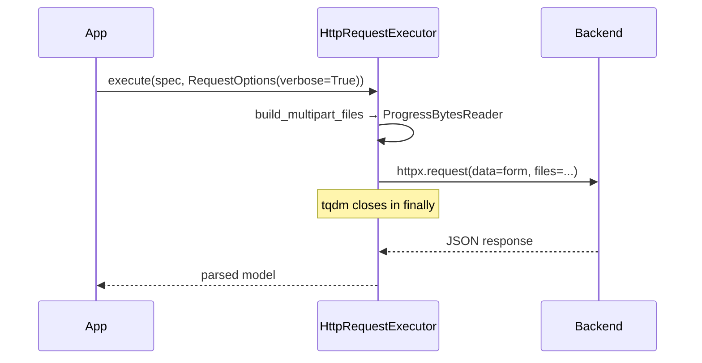
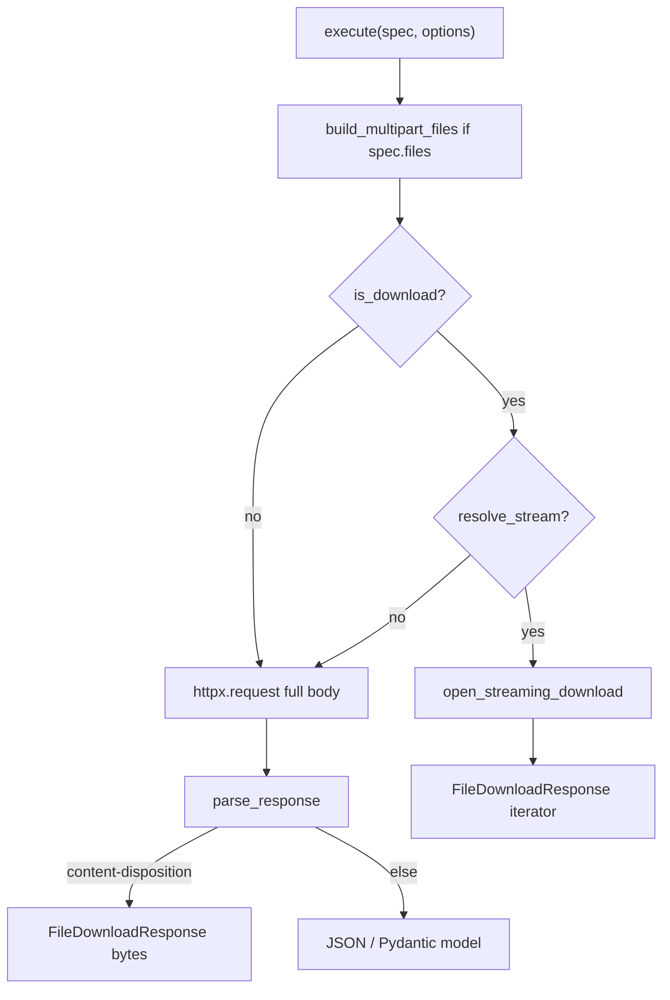

# SDK HTTP client flows

This document describes how the Experiment Tracker Python SDK sends HTTP
requests: JSON API calls, artifact uploads/downloads, progress bars (`verbose`),
and streaming downloads. It reflects the post-refactor layout under
`experiment_tracker_sdk/client/`.

## Layer overview



| Layer | Module | Role |
|-------|--------|------|
| Entry | `client/client.py` | Lifecycle, auth headers, queue, delegates to executor |
| Spec factories | `client/domain/*/service.py` | Build `ApiRequestSpec` for each API route |
| Artifacts | `client/artifact_client.py` | Project CAS, step artifacts, named artifacts |
| Batch I/O | `client/file_transfer.py` | Many files through one endpoint |
| Transport | `client/transport/*` | Single send + parse path, progress, streaming |
| Progress UI | `client/utils/transfer_progress.py` | tqdm wrappers (optional dependency at runtime) |

Every synchronous API call eventually goes through **`HttpRequestExecutor.execute`**
except background **`queued_request`** items (scalars only; see below).

---

## Core types

### `ApiRequestSpec`

Describes one HTTP call. Exactly one body style is allowed (enforced in
`__post_init__`):

| Field | HTTP encoding |
|-------|----------------|
| `request_payload` | `application/json` body |
| `form_data` + optional `files` | `multipart/form-data` |
| `files` only | `multipart/form-data` (file part only) |

`query_params` are always URL query parameters. `response_model` tells the
executor how to parse a successful JSON body (or marks an expected file download).

### `RequestOptions`

Controls transfer behavior for **`client.request(..., options=...)`** and batch
methods:

```python
from experiment_tracker_sdk.client import RequestOptions

RequestOptions(
    verbose=False,       # tqdm byte progress during upload/download
    stream=None,         # download streaming; None = auto (see below)
    progress_desc=None,  # tqdm label override
    progress_position=None,  # nested bars (batch transfers use 1 for per-file bar)
    progress_leave=True,
)
```

**Streaming default** (`resolve_stream` in `transport/options.py`):

- If `stream` is set explicitly → use that value.
- If `stream` is `None` and the request is a download → `verbose=True` enables
  streaming automatically (so tqdm can tick as chunks arrive).
- Uploads never stream the *response* because of `verbose`; upload progress uses
  a separate multipart reader path.

### `FileDownloadResponse`

Returned for file downloads:

- `content`: `bytes` (buffered) or `Iterator[bytes]` (streaming)
- `filename`: from `Content-Disposition` when present
- `content_type`: from `Content-Type`

Use `dump_binary_content_to_path()` (`client/utils/downloading.py`) to write
either shape to disk.

---

## Simple JSON requests

Typical CRUD / metrics / listing calls use a spec factory and `client.request`:

```python
from experiment_tracker_sdk.client import ExperimentTrackerClient, APIRequestsRegistry

client = ExperimentTrackerClient(base_url="http://127.0.0.1:8000", api_token="...")
registry = APIRequestsRegistry()

spec = registry.metrics.upsert_metric(
    experiment_id="...",
    name="accuracy",
    value=0.95,
)
result = client.request(spec)  # Pydantic model or dict
```



Flow inside the executor:

1. Build JSON payload from `request_payload` (Pydantic models are dumped).
2. **`_buffered_request`** — full response loaded into memory.
3. **`_parse_response`** — if `Content-Disposition` is present, treat as file;
   otherwise parse JSON and validate with `response_model`.

No `RequestOptions` needed for ordinary JSON calls.

---

## Queued requests (background scalars)

`queued_request` enqueues JSON (or multipart) work on a background thread. Used
by scalar batching during training — **not** for streaming downloads.

```python
client.queued_request(spec)
client.flush()  # wait for queue to drain
```

The queue worker in `client/queue.py` sends items with plain `httpx.request`.
Multipart file bytes are sent without tqdm progress.

---

## Multipart uploads (artifacts and generic files)

Artifact uploads attach a `FileUploadSpec` to the spec:

```python
FileUploadSpec(content=b"...", filename="image.png", content_type="image/png")
```

The executor calls **`build_multipart_files`** (`transport/multipart.py`):

- Default: raw `bytes` sent in one shot.
- `verbose=True` (and not a download): wraps bytes in `ProgressBytesReader` so
  httpx reads in slices and tqdm updates.



---

## Artifact uploads (high-level)

`ArtifactClient` (`artifact_client.py`) builds specs via `APIRequestsRegistry`
and calls `request_client.request`. `ExpTracker` owns an `ArtifactClient` as
`_artifacts`.

### 1. Step-based (during training)

Images, text, etc. logged at `global_step`:

```
ExpTracker.add_image / add_text
  → ArtifactClient.upload_and_log_experiment_artifact_at_step(verbose=...)
    → registry.experiment_artifacts.upload_and_log_experiment_artifact_at_step
    → client.request(spec, RequestOptions(verbose=...))
```

Multipart: form fields (`name`, `artifact_type`, `step`, …) + `file` part.
Backend stores blob and writes scalars metadata.

### 2. Named / tracked (checkpoints, configs)

No step; stable `filepath`:

```
ExpTracker.log_final_artifact(...)
  → ArtifactClient.upsert_named_experiment_artifact(verbose=...)
```

### 3. Project CAS (deduplicated by hash)

```
ArtifactClient.upload_project_artifact(...)
  → check_project_artifacts (JSON POST)
  → if hash missing: upload_project_artifact spec (multipart + ?hash= query)
```

`verbose=True` only affects the upload step, not the hash check.

### Verbose on `ExpTracker`

- Constructor: `ExpTracker(..., verbose=True)` sets default for all artifact uploads.
- Per call: `add_image(..., verbose=True)` or `verbose=False` overrides the default.
- Resolved by `_resolve_verbose()` before calling `ArtifactClient`.

---

## Downloads

### Detecting a download

`HttpRequestExecutor._is_download` returns true when:

- `spec.response_model is FileDownloadResponse`, or
- `options.stream is True` (explicit streaming intent)

Otherwise the call follows the JSON/buffered path; if the server still sends
`Content-Disposition`, `_parse_response` returns `FileDownloadResponse` with
**buffered** `bytes`.

### Buffered vs streaming

| Mode | When | `content` type | Memory |
|------|------|----------------|--------|
| Buffered | default for artifact GETs | `bytes` | Full file in RAM |
| Streaming | `stream=True` or `verbose=True` on a download | `Iterator[bytes]` | Chunk-by-chunk |

Streaming opens **`open_streaming_download`** (`transport/streaming.py`):

1. `httpx.Client.stream(...)` — connection stays open.
2. On success, returns `FileDownloadResponse` with a generator.
3. Generator yields chunks (optionally through `iter_download_chunks_with_progress`).
4. **`finally`**: exits stream context when iterator is exhausted or on error.

**Important:** consume the full iterator (or write to disk) so the HTTP connection
closes cleanly.

### Artifact downloads

```python
from experiment_tracker_sdk.client import ArtifactClient

artifacts = ArtifactClient(registry, client)

# In memory (buffered by default)
download = artifacts.download_experiment_artifact_at_step(
    experiment_id, step=100, name="loss_plot"
)

# Stream large file
download = artifacts.download_named_experiment_artifact(
    experiment_id, filepath="checkpoints/model.bin", stream=True
)

# Write directly to disk
path = artifacts.download_named_experiment_artifact(
    experiment_id, filepath="checkpoints/model.bin", output_path="/tmp/model.bin"
)
```

`output_path` may be a directory; the filename comes from `Content-Disposition`
when available.

---

## Batch file transfer

For many files against the **same endpoint** with **per-item query params**, use
methods on `ExperimentTrackerClient` (implemented in `file_transfer.py`):

```python
from experiment_tracker_sdk.client import (
    RequestOptions,
    FileUploadItem,
    FileDownloadToPathItem,
)

# Upload
client.upload_files_batch(
    "/my/upload/endpoint",
    items=[FileUploadItem(params={"id": "1"}, filename="a.bin", content=b"...")],
    options=RequestOptions(verbose=True),
)

# Download to paths
client.download_files_batch_to_paths(
    "/my/download/endpoint",
    items=[FileDownloadToPathItem(output_path="/tmp/a.bin", params={"name": "a"})],
    options=RequestOptions(verbose=True),
)
```

Each batch builds an `ApiRequestSpec` per item and calls the same executor.

**Verbose batch UI:**

- Outer bar: file counter (`2/5 files`) via `batch_items_progress`.
- Inner bar: byte progress per file at `progress_position=1`.

With `RequestOptions(verbose=True)`, downloads auto-enable streaming via
`resolve_stream(..., is_download=True)`.

---

## Executor decision tree



---

## Module reference (transport)

| File | Responsibility |
|------|----------------|
| `transport/options.py` | `RequestOptions`, `resolve_stream`, `with_progress` |
| `transport/errors.py` | `raise_for_status`, `convert_payload_to_json` |
| `transport/headers.py` | `parse_content_disposition` |
| `transport/multipart.py` | httpx file tuples + upload tqdm |
| `transport/streaming.py` | stream context + download tqdm |
| `transport/executor.py` | `HttpRequestExecutor` — single entry point |

---

## Quick reference: which API to use

| Goal | API |
|------|-----|
| JSON CRUD / metrics | `client.request(registry.*.spec())` |
| Background scalars | `client.queued_request(spec)` + `flush()` |
| Upload artifact (domain) | `ArtifactClient` or `ExpTracker.add_*` / `log_final_*` |
| Download artifact | `ArtifactClient.download_*` with optional `stream=` / `output_path=` |
| Many files, one endpoint | `upload_files_batch` / `download_files_batch*` |
| Upload progress bar | `RequestOptions(verbose=True)` or `ArtifactClient(..., verbose=True)` |
| Download progress bar | `RequestOptions(verbose=True)` or batch with `verbose=True` |
| Large download, low RAM | `stream=True` or `verbose=True` on download |
| Save download to disk | `output_path=` on `ArtifactClient`, or `download_files_batch_to_paths`, or `dump_binary_content_to_path` |

---

## Example: verbose end-to-end

See `examples/verbose-artifact-transfer/train.py` in the repository root:

1. `ExpTracker.init(..., verbose=True)` — default upload bars.
2. `log_final_artifact(..., verbose=True)` — per-file upload tqdm.
3. `client.download_files_batch_to_paths(..., options=RequestOptions(verbose=True))`
   — batch counter + per-file download bars with streaming.
